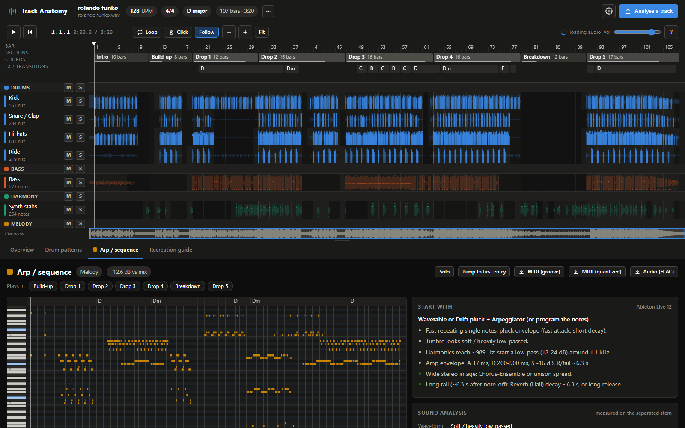
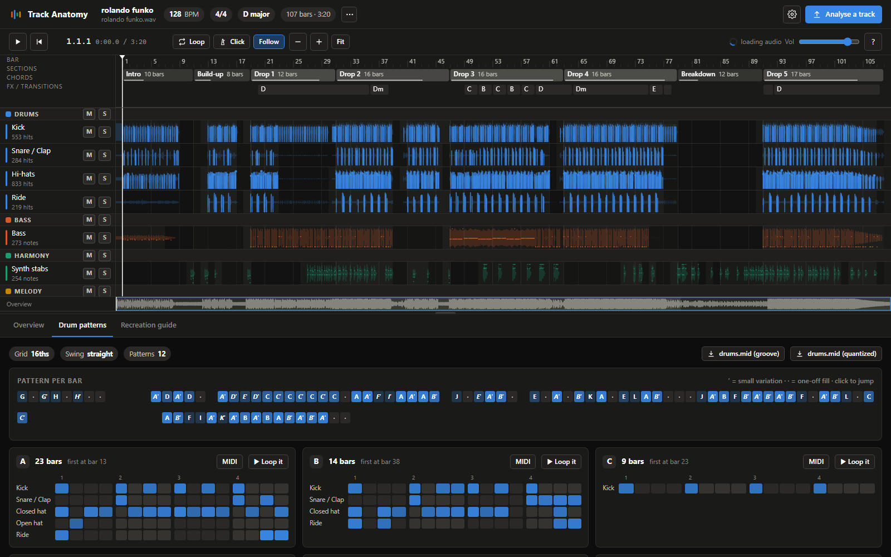
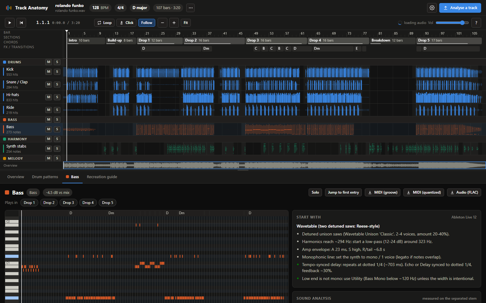
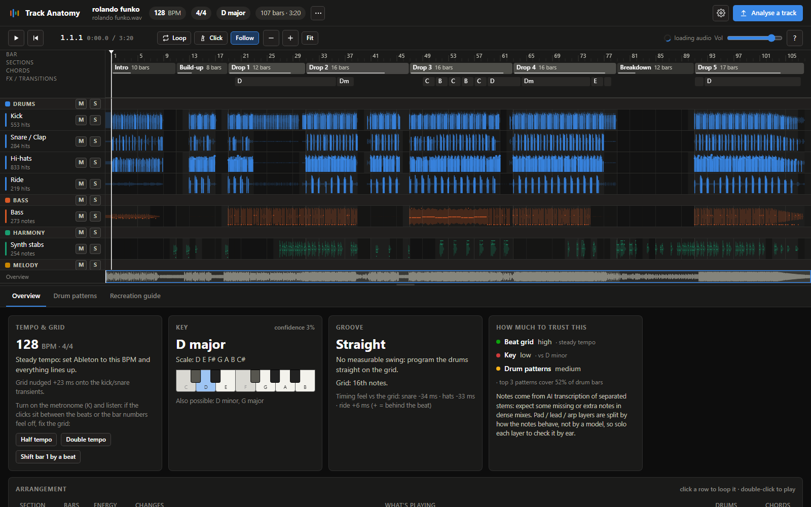
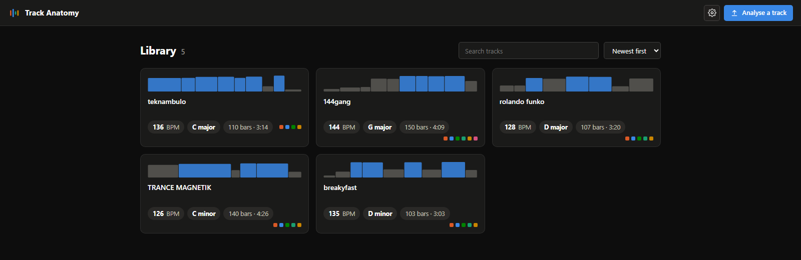

<div align="center">

# Track Anatomy

**Drop in a song. See every part of it. Rebuild it in Ableton.**

Track Anatomy separates a finished mix into its parts (kick, snare, hats, bass, pads, leads,
arps, vocals, FX), transcribes them, maps the arrangement bar by bar and hands you a ready-made
Ableton Live Set to rebuild the track in. Everything runs locally.



</div>

## What you get

| | |
|---|---|
| **Arrangement map** | Sections (Intro, Build-up, Drop, Verse, Chorus, Breakdown…), a lane per part showing where it plays, the chord lane, and transitions: risers, snare rolls, impacts, drop-outs. For every section: what enters and what leaves. |
| **Drums** | Kick, snare/clap, toms, open/closed hats, ride and crash as separate stems. Every bar as a 16-step grid, grouped into patterns A/B/C with variations, plus swing, timing feel and a groove template. |
| **Pitched parts** | Bass, vocals, keys, guitar and the synth stem split into pad / stabs / riff / lead / arp layers (plus an atmos/FX residual), each with a piano roll and MIDI (as played and quantized). |
| **Harmony** | Key (with confidence and alternatives), chord progression with Roman numerals, repeating chord loops per section, key changes. Click a chord or a note to hear it. |
| **Sound design** | Waveform guess from the harmonic spectrum, unison/detune movement, filter starting point, amplitude envelope, stereo width, sidechain-pumping curve, reverb tail, tempo-synced delay, filter sweeps; turned into Ableton device suggestions. |
| **Listening tools** | Sample-accurate solo/mute of any part, loop any section or bar range, a click track on the detected grid, follow-playhead. |
| **Export** | An Ableton Live 12 set (tempo, time signature, a locator per section, a MIDI track per part, every stem on an audio track warped to the grid, the track's groove in the Groove Pool), MIDI files, bar-1-aligned stems and a Markdown recreation guide. |

<table><tr>
<td></td>
<td></td>
</tr><tr>
<td></td>
<td></td>
</tr></table>

## Requirements

- Linux, macOS, or Windows via **WSL2** (recommended on Windows)
- Python 3.11 or 3.12, [uv](https://docs.astral.sh/uv/) and **ffmpeg** on the `PATH`
- An NVIDIA GPU is strongly recommended (about 2–3 min per track on an RTX 3070).
  Apple Silicon (MPS) and CPU work too, but separation is much slower (roughly 10–20 min per track on CPU).
- ~2 GB of disk for models, and ~300–600 MB per analysed track (stems are kept so you can solo them)
- Ableton Live 11/12 installed is optional: it is only used as the template for `.als` export.
  Without it you still get stems + MIDI + the guide.

## Install and run

```bash
git clone https://github.com/sebkrier/track-anatomy.git
cd track-anatomy
./setup.sh        # .venv with PyTorch for your hardware (NVIDIA / Apple Silicon / CPU) + audio libraries
./run.sh          # then open http://localhost:8102
```

The first analysis downloads the models (~1.3 GB) into `models/`. Drop audio files anywhere on the
page (several at once is fine: they queue). Tracks, stems and exports live in `data/`.

<details>
<summary>Installing as a Python package instead</summary>

```bash
pip install "track-anatomy @ git+https://github.com/sebkrier/track-anatomy"
pip install --no-deps basic-pitch==0.4.0     # its declared deps pull TensorFlow, which isn't needed
track-anatomy serve
```

Data and models then live in `~/.local/share/track-anatomy/` (override with `TRACK_ANATOMY_DATA`
and `TRACK_ANATOMY_MODELS`). On Linux, PyPI's torch wheels include CUDA; `setup.sh` remains the
tested path.
</details>

<details>
<summary>Command line</summary>

```bash
.venv/bin/python -m track_anatomy analyze song.mp3            # analyse a file, print a summary
.venv/bin/python -m track_anatomy export <track-id> ~/Music   # write an Ableton project folder
.venv/bin/python -m track_anatomy list                        # what's in the library
.venv/bin/python -m track_anatomy serve --port 8200            # the web app on another port
```
</details>

<details>
<summary>Configuration (environment variables)</summary>

| Variable | Default | |
|---|---|---|
| `TRACK_ANATOMY_PORT` / `_HOST` | `8102` / `127.0.0.1` | Server address. Keep it on localhost: the API has no authentication. |
| `TRACK_ANATOMY_DATA` | `./data` | Tracks, stems and exports |
| `TRACK_ANATOMY_MODELS` | `./models` | Downloaded model weights |
| `TRACK_ANATOMY_ALLOWED_HOSTS` | | Extra host names the server answers to (comma-separated), e.g. behind a reverse proxy |
| `TRACK_ANATOMY_DEVICE` | auto | `cuda`, `mps` or `cpu` |
| `TRACK_ANATOMY_STEM_MODEL` | `bs-roformer-sw` | or `htdemucs-6s` (see licenses below); also switchable in Settings |
| `TRACK_ANATOMY_MAX_MINUTES` | `30` | Longest accepted track |
| `TRACK_ANATOMY_MAX_UPLOAD_MB` | `1024` | Largest accepted upload |
| `TRACK_ANATOMY_ABLETON_TEMPLATE` | auto-detected | Path to Live's `DefaultLiveSet.als` |
| `TRACK_ANATOMY_OFFLINE` | `0` | `1` = no network access at all once the models are downloaded |
</details>

## How it works

```
upload ─► decode (ffmpeg) ─► 6-stem separation ─► drum split ─► beats / downbeats ─► sections
                                   │                                  │
                                   └─► note transcription per stem ─► chords & key
                                                                      │
      analysis: drum hits & patterns · note roles (pad/lead/arp) · sound design · FX events
                                                                      │
                               UI (arrangement, piano rolls, drum grids) + exports (.als, MIDI, guide)
```

| Step | Tool |
|---|---|
| 6-stem separation | [BS-RoFormer SW](#models-and-licenses) or Demucs `htdemucs_6s`, via [python-audio-separator](https://github.com/nomadkaraoke/python-audio-separator) |
| Drum split | MDX23C DrumSep (kick, snare, toms, hi-hat, ride, crash) |
| Beats / downbeats | [beat_this](https://github.com/CPJKU/beat_this); one tempo per track when the beats support it (phase-coherence fit that tolerates a tracker wandering in breakdowns, whole-number BPM when it fits), otherwise the grid follows the performance; double/half-time repair; nudged onto the kick transients |
| Sections | [All-In-One](https://github.com/openmirlab/all-in-one-infer) (Harmonix labels), relabelled from what actually plays |
| Notes | [basic-pitch](https://github.com/spotify/basic-pitch) (ONNX) per stem, gated against stem energy, bass bleed removed |
| Chords / key | [lv-chordia](https://github.com/rrherr/lv-chordia); key from note + chord chroma (Krumhansl–Kessler) |
| Everything else | own DSP in `track_anatomy/pipeline/` (drum patterns, roles, sound design, FX, structure, `.als` writer) |

Each step caches its results in the track folder, so re-running the analysis (for example after
fixing the tempo or bar 1 from the UI) only redoes the fast part.

## Honest limits

- Everything is measured on **separated** audio. Separation artefacts show up as occasional ghost
  notes or hits: solo a part to check it by ear.
- Splitting the synth stem into pad / lead / arp is a heuristic based on how the notes behave;
  no open model separates synth roles.
- Sound-design values are starting points for your own patch, not a recall of the original.
- Beat tracking assumes a pulse. Free-time, ambient or heavily rubato music gets a placeholder
  grid (flagged in the UI). If the tempo comes out doubled or halved, or bar 1 is off by a beat,
  fix it in Overview → Tempo & grid: only the fast part of the analysis re-runs.
- Section names come from a model trained mostly on pop songs, then corrected from what actually
  plays. Boundaries are usually right; names like Drop vs Chorus are a judgement call.

## Troubleshooting

| | |
|---|---|
| "CUDA out of memory" | Close other GPU apps, or run on CPU with `TRACK_ANATOMY_DEVICE=cpu ./run.sh`. |
| No `.als` in the export | Live's `DefaultLiveSet.als` wasn't found: set `TRACK_ANATOMY_ABLETON_TEMPLATE` (see Settings). |
| Export folder on Windows while running in WSL | Type the Windows path (`D:\Music\Ableton`); it's translated. |
| A track analysed with an older version | The library offers a one-click refresh (stems are reused, under a minute per track). |
| Analysis failed | The processing page shows the reason; *Retry* resumes from the last finished step. |

## Models and licenses

Track Anatomy's own code is released under the [MIT license](LICENSE). It downloads
third-party model weights at run time; **they are not part of this repository and come with
their own terms.** Check them before any commercial use.

| Model | Used for | License |
|---|---|---|
| MDX23C DrumSep (aufr33 & jarredou) | drum split | **CC BY-NC (non-commercial)** per the authors' repository |
| BS-RoFormer SW | 6-stem separation (default) | **Unknown.** Author and training data are not documented; rehosted by python-audio-separator. Switch to Demucs in Settings if that matters to you. |
| Demucs `htdemucs_6s` / `htdemucs` (Meta) | 6-stem separation (alternative); used inside All-In-One | MIT |
| beat_this `final0` (CPJKU) | beats, downbeats | MIT |
| All-In-One `harmonix-*` | sections | MIT (trained on the Harmonix Set) |
| basic-pitch (Spotify) | notes | Apache-2.0 |
| lv-chordia | chords | MIT |

Separation models were popularised by the [Ultimate Vocal Remover](https://github.com/Anjok07/ultimatevocalremovergui)
community; thanks to its authors. Because of the DrumSep weights, treat Track Anatomy as a
**personal, non-commercial** tool. Only analyse music you have the right to use.

## Privacy and security

Your audio and the analysis never leave your machine: no accounts, no analytics, no telemetry.
The only network traffic is downloading model weights (the section model's library also checks
for updates on each analysis); set `TRACK_ANATOMY_OFFLINE=1` after the first run to rule out any
network access.

The server has no login, so it only listens on localhost and refuses anything that doesn't come
from its own page: unknown host names (DNS rebinding), cross-site requests, state changes without
the app's header, and framing by other sites. Details and how to report a problem:
[SECURITY.md](SECURITY.md).

## Contributing

Issues and pull requests are welcome.

```bash
.venv/bin/pip install -e ".[dev]"     # or: pip install -r requirements-dev.txt (tests only, no models)
.venv/bin/pytest                      # unit + API tests, no models needed
.venv/bin/ruff check .
```

Keep the UI dependency-free (plain ES modules, no build step). See [CHANGELOG.md](CHANGELOG.md).

## License

MIT for Track Anatomy's code (see [LICENSE](LICENSE)); the downloaded model weights keep their
own licenses, listed above.
